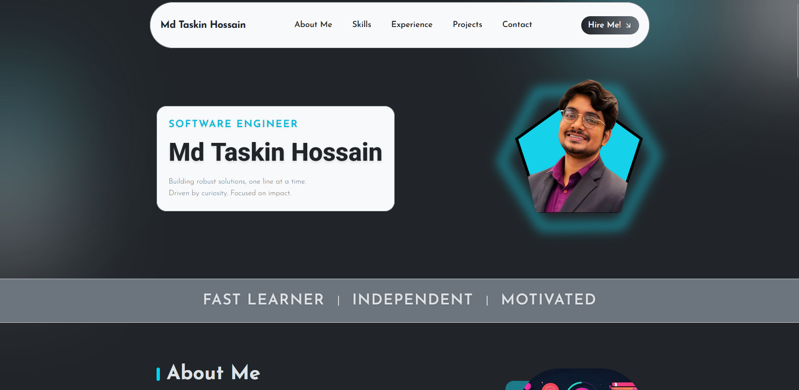

# 🖥️ Md Taskin Hossain — Portfolio Website

🌐 [Live Website](https://setaf007.github.io/taskin_portfolio/)

> A sleek, modern, and fully responsive portfolio website built with React.

---

## ✨ Features

- Clean, modern UI and smooth animations
- Responsive design for all devices
- About Me, Skills, Experience, Projects, and Contact sections
- Project filtering and interactive cards
- EmailJS-powered contact form
- Fast performance with Vite
- Easy to customize and extend

---

## 🚀 Tech Stack

- [React](https://react.dev/)
- [Vite](https://vitejs.dev/)
- [Tailwind CSS](https://tailwindcss.com/)
- [EmailJS](https://www.emailjs.com/) (for contact form)

---

## 📸 Preview

---

Note: npm run deploy to update. gh-pages workflow established.